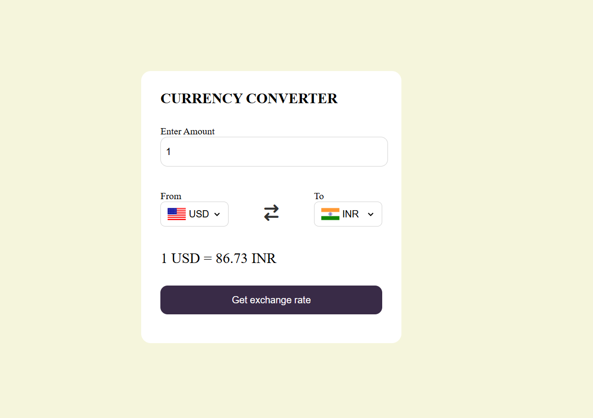

# 💱 Currency Converter

A simple, responsive web-based **Currency Converter** built with HTML, CSS, and JavaScript. This app allows users to convert one currency into another using **real-time exchange rates** fetched from a public API.



---

## ✨ Features

- 🔁 Convert between all major world currencies
- 🌐 Live exchange rates via [ExchangeRate API](https://www.exchangerate-api.com/)
- 💡 Smart defaults (USD → INR)
- ⚡ Instant calculation and smooth button effects
- 🎌 Country flags dynamically displayed for selected currencies
- 📱 Responsive and mobile-friendly layout
- 🛑 Error handling for invalid or missing inputs

---

## 🛠️ Tech Stack

- HTML5
- CSS3
- JavaScript (ES6+)
- [ExchangeRate API](https://open.er-api.com/) for real-time currency data
- [FlagsAPI](https://flagsapi.com/) for country flags

---

## 🚀 How to Use

### 🔗 Live Demo

### 🧑‍💻 Run Locally

1. **Clone this repository:**
   ```bash
   git clone https://github.com/isha1shah/currency-converter.git
